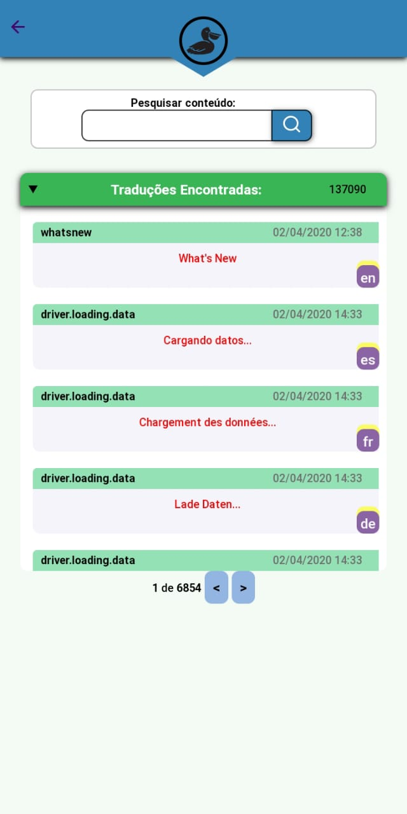
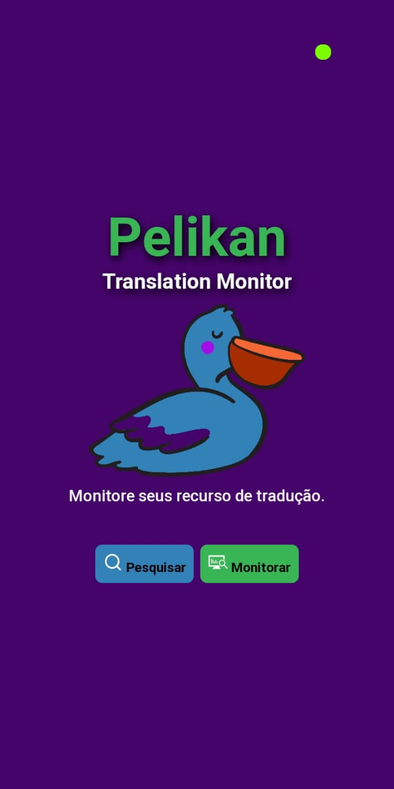
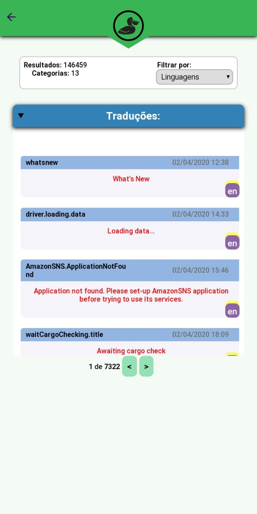

# Relatório de Progresso

## Sobre o problema

**Problema:** Um empresário traduziu seu software para várias línguas ao atender seus inúmeros clientes internacionais. Ele gostaria de verificar se as traduções de porções do seu software estão corretas, usando seu smartphone durante as viagens.

**Requisítos:**
* Apresentar as traduções
* Filtro de linguagens e modulos
* Pesquisa por conteúdo
* Consumo de uma API não é otimizado para leitura geral

## Relatório de atividades

### Day 1
(07 Ago 2020)

* Recebi a proposta da atividade.
* Pretendo usar o modelo de PWA
* Preparei o projeto express
* Fiz os primeiros testes de frontend

### Day 2 

* Conclui o frontEnd para experimentar visualizar o load dos dados direto no app.
    - não comecei recebendo os dados pela base de dados parecer que parece muito grande *(bastou aumentar o Timeout do fetch)*
* Me deparei com um erro de CORs ao tentar usar o fetch para receber os dados *(em localhost dava problema, mas bastoy adicionar um parâmetro no fetch)*
* Acredito ter resolvido o problema do CORs usando proxi *(não precisou)*
* agora tenho que tratar o problema da base da dados ser grande demais, não posso fazer uma leitura geral.

### Day 3 e 4 Dias

* Foi bem trabalhoso conseguir a achar uma solução para a leitura dos dados, pois a API, foi propositadamente, feita para não poder fazer uma leitura geral de dados. Após muita pesquisa descobri que bastava colocar um timeout maior no segundo parametro do fetch.
* Antes de conseguir ler os dados, estava tentando montar o front-end com base no que sabia dos dados, e ver eles finalmente chegando foi sensacional.

### Day 5

* Termino da organização do Front-End (mostrar os dados)
* Trabalhar com os requisitos:
    - Pesquisa
    - filtrar dados
* **Hospedado:** [Pelikan TM](https://pelikan-tm.herokuapp.com/)

## Para poder Testar:

Para executar este projeto basta ter o **node.js**, **VScode** e um **navegador** (chromer). Além disto, algumas dependências são nescessárias.

~~~bash
npm install nodemon express nunjucks
~~~